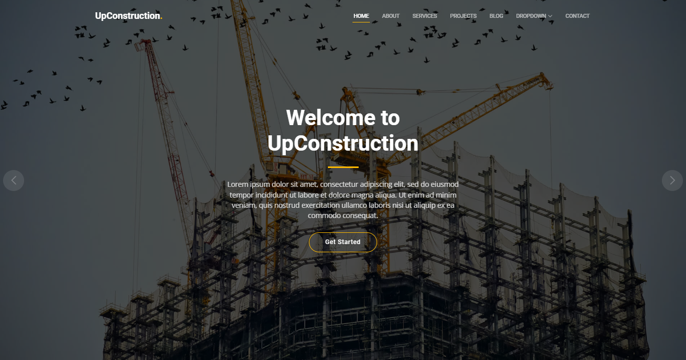

  <h1>MyPortfolio</h1>

  <h3>O que é uma hero section?</h3>
  
Como a primeira coisa que as pessoas veem quando visitam seu site, uma seção hero é a área que aparece imediatamente na tela sob seu logotipo e menu, como mostrado no exemplo logo a seguir.

  

  <h3>O que deve compor uma hero section?</h3>
  

    Esta parte da página deve idealmente incluir informações sobre quatro coisas:  
    <strong>
    1.O que você tem a oferecer; 
    2.Por que as pessoas devem confiar em você; 
    3.Os benefícios de trabalhar com você; 
    4.Que ação eles devem tomar em seguida.
    </strong>
  

  <h3>Vamos ententer um pouco mais</h3>
  

  Junto com esses aspectos-chave, você também vai querer encontrar uma maneira de destacar sua marca da concorrência. Existem várias ideias de design de seção de     heróis que você pode usar, dependendo da aparência do seu site e do estilo que você preferir. Uma empresa de web design confiável pode discutir as opções com você e apontar qual delas eles acham que será mais eficaz para o seu site.  
  
  Lembre-se de que você não precisa criar uma seção principal para cada página em um site. Qualquer página da Web que um visitante em potencial possa acessar em seu     site sem digitar a URL diretamente no navegador é chamada de página de destino. E cada seção de herói da página de destino deve seguir as diretrizes adequadas para   garantir que estejam no mesmo nível.  
  
  Você descobrirá que existem algumas práticas recomendadas a serem incluídas em cada uma delas para obter mais sucesso à medida que são projetadas.
  

